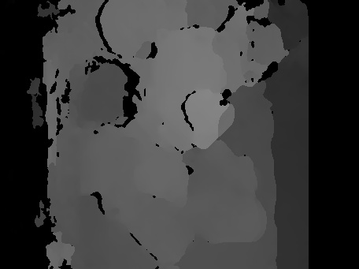
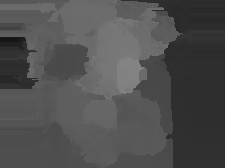

The details of the algorithm from Xu and Jia :cite:`XU2012` and its implementation will be
described here...

.. raw:: LaTex

    \begin{figure}[!htb]
        \centering
        \begin{subfigure}{.5\textwidth}
            \centering
            \includegraphics[width=170pt]{../images/mouse_left.jpg}
            \caption{left image}
        \end{subfigure}%
        \begin{subfigure}{.5\textwidth}
            \centering
            \includegraphics[width=170pt]{../images/mouse_right.jpg}
            \caption{right image}
        \end{subfigure}
        \caption{Blurred input images}
    \end{figure}

First-Pass Estimation
+++++++++++++++++++++

Disparity Estimation
--------------------

Disparity Map
'''''''''''''

- :red:`Find disparity map of a blurred stereo image pair.`
- :red:`down-sampling for blur reducing`
- :red:`different stereo algorithm as in paper. This shouldn't effect overall result`
- :red:`violation of stereo matching condition. handle boundary pixel separately`

   disparity map with occlusions

Occlusions
''''''''''

:red:`Cross-Checking to find occlusion regions.` In this implementation there is no cross checking
because SGBM handles occluded regions already.

Occlusions are filled with smallest neighbor disparity. Assumption: just objects with small
disparity can be occluded.

   disparity map with filled occlusions

Quantization
''''''''''''

:red:`PSF estimation is less extensive if the disparity layers are reduced.` quantize disparity 
values to l regions, where l is set to approximate PSF width or height. :red:`how to approximate
the PSF width/height?`

Added smoothing with median filter (:red:`add reason for this filter`) before quantization to
eliminate noise in disparity map

.. figure:: ../images/dmap_final.jpg
   :width: 250 pt
   :alt: disparity map quantized

   Final disparity map

Region-Tree Construction
------------------------

This is needed for robust PSF estimation.

PSF Estimation for Top-Level Regions
------------------------------------

PSF Propagation
---------------

Blur Removal
------------

Second-Pass Estimation
++++++++++++++++++++++

Disparity Update
----------------

PSF Estimation
--------------