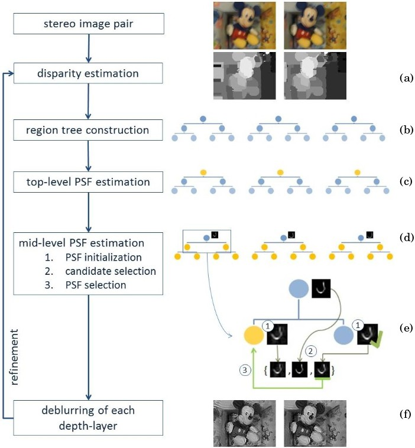
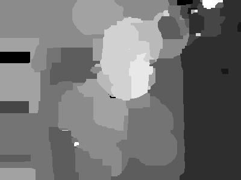
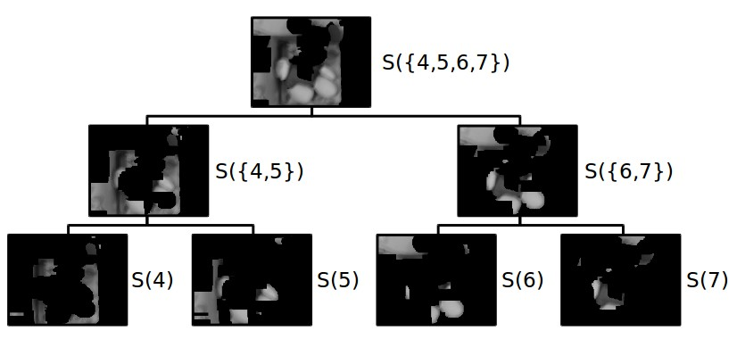
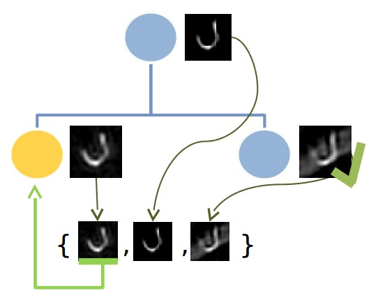

The depth-aware motion deblurring algortihm from Xu and Jia :cite:`Xu2012` deblurs a stereo image pair of a scene with depth variations as shown in figure :ref:`input`. The challenge of this setup is the unkown camera motion restricted to be parallel to the scene. The depth variantions of the scene makes it necessary to estimate spatially-variant blur kernels - a PSF for each depth level. A great issue of this process is PSF estimation from depth levels with a small number of pixels.

The basic idea of the proposed method to deblur this challeging setup and the difficulties of this algorithm will be presented in this chapter.

.. raw:: LaTex

    \begin{figure}[!htb]
        \centering
        \begin{subfigure}{.5\textwidth}
            \centering
            \includegraphics[width=170pt]{../images/mouse_left.jpg}
            \caption{left image (reference view)}
        \end{subfigure}%
        \begin{subfigure}{.5\textwidth}
            \centering
            \includegraphics[width=170pt]{../images/mouse_right.jpg}
            \caption{right image (matching view)}
        \end{subfigure}
        \caption{Blurred input images}
        \label{input}
    \end{figure}

Basic Idea
++++++++++

A stereo image pair is used to obtain the necessary depth information for depth-aware deblurring. Stereo matching has a long tradition and many well working algorithms like semi-global block matching or graph-cut approaches were proposed. Using stereo images to obtain depth information thus is a appropriate decision.

A hierarchical approach is used to make the PSF estimation robust for each depth level, even for depth levels with a small number of pixels. Thus a region tree is constructed to guide PSF estimation in small regions. This tree holds all depth layers (regions of nearly constant depth) as leafs and merges them to larger regions. This is feasible due to the fact that the PSF is similar for close by depth levels. PSFs are estimated from larger regions to smaller ones. Because PSF estimation can be still error prone the final PSF is selected from candidates containing parent PSF, estimated PSF and reliable sibbling PSF.

In the end each depth layer is deconvolved with its PSF. This deblurred stereo image pair is used to refine the disparity estimation. Due to more accurate depth edges the PSF estimation is improved in a second run. This process is shown in figure :ref:`algo`.

   :label:`algo` algorithm overview

Reference Implementation
++++++++++++++++++++++++

The reference implementation for the depth-aware motion deblurring algorithm provides a command line interface and a C++ library. A OpenCV 3.0 installation is required for this project. For further information please read the *README* of this project. The source code can be found online: *github.com/kruegerfr/depth-aware-motion-deblurring*

Disparity Estimation
++++++++++++++++++++

The main idea of the algorithm is the independent deblurring of each depth layer since scenes with depth variations yield spatially-variant blur kernels. As stated before a stereo image pair is used to obtain depth information using stereo matching.

Disparity Map
-------------

Disparity maps :math:`d` are computed for the reference view :math:`B_r` and the matching view :math:`B_m` of the stereo image pair. This is done by minimizing the following energy function:

.. math:: :numbered:
    
    E(d) = \| B_m(x - d(x)) - B_r(x)\|^2 + \gamma_d min(\nabla d^2, \tau)

The truncated smoothing function :math:`\gamma_d min(\nabla d^2, \tau)` is used for regularization (:red:`explain regularization and parameter tuning`). This energy minimization problem is solved by graph-cuts :cite:`Kolmogorov2001`. The source code of this stereo matching algorithm was available and is embedded in the reference implementation.

It is easy to change the stereo matching algorithm to another one in the implementation. So semi global block matching (SGBM) :cite:`Hi2007` were also tested but the graph cut approach yields a better disparity.

A general problem of stereo matching are occlusions which leads to errors at object borders. A pixel of an occluded region can not be matched because it is hidden in one view. Mainly because it is located behind an object nearer to the camera. The occluded regions are determined using cross-checking comparing disparity values of both disparity maps. Different disparity estimations for corresponding pixels indicate occlusion. It is appropriate to fill the occlusions with the smallest neighboring disparity since only objects with a small disparity - indicating they are further away from the camera - can be occluded. The disparity results of the graph-cut approach are shown in figure :ref:`dmap-algo`.

.. raw:: LaTex

    \begin{figure}[!ht]
        \centering
        \begin{subfigure}{.5\textwidth}
            \centering
            \includegraphics[width=170pt]{../images/dmap-algo-left.png}
            \caption{left-right}
        \end{subfigure}%
        \begin{subfigure}{.5\textwidth}
            \centering
            \includegraphics[width=170pt]{../images/dmap-algo-right.png}
            \caption{right-left}
        \end{subfigure}
        \caption{disparity maps with filled occlusions}
        \label{dmap-algo}
    \end{figure}

Another problem are the blurred object boundaries which also yields bad depth egdes. This affects all following steps but mainly deblurring since pixel of different depth level are used to estimate a PSF of one depth level producing errors. So an separate handling for pixels of region boundaries is necessary. We will see that this is done for deblurring of each depth level. The deblurred images of the first algorithm run then are used to improve the object boundaries of the disparity maps for a second run.

Quantization
------------

The initial disparity map can yield many different levels leading to an extensive PSF estimation. The computation cost can be reduced by decreasing the number of different depth levels. The influence of small disparity changes is negligible for PSF estimation so it adequate to estimate one blur kernel for nearly equal depth levels. Hence the disparity maps are quantized. The paper showed that 12 different depth layers are good enough in practice. 

The reference implementation uses a k-means clustering at once on both disparity maps for ensuring that same depth levels are mapped to the same cluster. Since the cluster assignment is random the clusters are sorted representing the depth graduation. The figure :ref:`dmap-quant` shows the 12 depth layers.

   :label:`dmap-quant` quantized disparity map with 12 regions (left view)

This quantization is useful of another aspect than computational cost too. It merges continuous depth changes on an object to one depth layer probably yielding a region with more information (texture) for PSF estimation.

Region-Tree Construction
++++++++++++++++++++++++

The regions of the different depth layer can be still very small lacking texture information. In these regions robust PSF estimation is not possible. The solution from Xu and Jia is a hierarchical estimation scheme where similar depth layers are merged to form larger regions. Hence the PSF estimation is done from large region where a robust PSF estimation is possible to smaller regions where PSF estimation is guided with the parent estimate. The structure for this is called region tree and in the implementation it is the *RegionTree* class.

   :label:`regiontree` one part of the region tree where the depth layers 4-7 are merged together to one top-level node

The region tree is a binary tree with all depth layers as leaf nodes. Each mid or top level node is calculated the following way: depth layer S(i) and S(j) are merged if i and j are neighboring numbers and :math:`i = ⌊j/2⌋ * 2` which ensures that the neighbor of the current node is merged only once. If a node do not have any neighbor for merging the node becomes a top level node. This is done until the user specified number of top level nodes are reached (the default number is 3).

The *RegionTree* class stores binary masks of all depth layer regions in the leaf nodes. The region of every other node can be computed by simply adding the masks of the regions that are contained in the current node. The figure :ref:`regiontree` shows one part of the region tree showing the merging of depth layer 4 to 7 resulting in one top-level node containing a large region.

PSF Estimation for Top-Level Regions
++++++++++++++++++++++++++++++++++++

Since the region tree merges similar depth layers to large top-level regions with nearly equal depth a robust estimation of one blur kernel is possible. Any algorithm for uniform blur kernel estimation could be applied for this step. The paper uses the two-phase kernel estimation algorithm by Xu :cite:`Xu2010`. Unfortunately the source code for this algorithm is not available.

Due to a too high time effort the reference implementation does not implement this estimation step. Therefore blur kernels for the top-level nodes are simply loaded. Thus the user has to provide these blur kernels. To stick as near as possible to the paper the supplied executable for the two-phase kernel estimation algorithm is used for all results shown in this study thesis. The figure :ref:`top-level` shows the PSF estimates of this algorithm on the three top-level regions.

.. raw:: LaTex

    \begin{figure}[!ht]
        \centering
        \begin{subfigure}{.35\textwidth}
            \centering
            \includegraphics[width=100pt]{../images/top-0-left.jpg}
            \caption{background}
        \end{subfigure}%
        \begin{subfigure}{.35\textwidth}
            \centering
            \includegraphics[width=100pt]{../images/top-1-left.jpg}
            \caption{middle}
        \end{subfigure}%
        \begin{subfigure}{.35\textwidth}
            \centering
            \includegraphics[width=100pt]{../images/top-2-left.jpg}
            \caption{foreground}
        \end{subfigure}

        \begin{subfigure}{.35\textwidth}
            \centering
            \includegraphics[width=35pt]{../images/kernel0.png}
            \caption{background}
        \end{subfigure}%
        \begin{subfigure}{.35\textwidth}
            \centering
            \includegraphics[width=35pt]{../images/kernel1.png}
            \caption{middle}
        \end{subfigure}%
        \begin{subfigure}{.35\textwidth}
            \centering
            \includegraphics[width=35pt]{../images/kernel2.png}
            \caption{foreground}
        \end{subfigure}
        \caption{top-level-regions (left view) and their PSFs (using two-phase kernel estimation executable)}
        \label{top-level}
    \end{figure}

As shown in figure :ref:`top-level` the top-level regions are of an arbitrary shape yielding images with black regions. This is a problem for uniform kernel estimation since an estimation algorithm would use the borders between the black regions and the depth layer region as texture information. As shown in the related work chapter many kernel estimation algorithm depend on edge filters. These borders would yield high gradients affecting the PSF estimation. There are two ways to deal with this problem: using an algorithm with mask support considering only pixels inside the specified mask for PSF estimation or filling the black regions with a color that minimizes the gradients at the region borders. The last approach is used in the reference implementation.

Iterative PSF Computation
+++++++++++++++++++++++++

After PSF estimation for top-level nodes all other mid- and leaf-level nodes can be estimated level-wise going through the region tree from top to bottom. Therefore each node has a parent PSF estimate guiding the current PSF estimation. This attenuates the effect that regions are getting smaller in each level of the region tree. This guidance is not enough for very small regions lacking any texture. Therefore a PSF selection scheme taking other PSF candidates into account for the current PSF estimation has to be applied. So the whole process of finding a suitable PSF for each mid- and leaf-level node divides into two steps: the initial PSF estimation and a PSF selection from possible candidates. The figure :ref:`mid-est` illustrates this process.

   :label:`mid-est` A PSF selection process for the current mid/leaf-level node (yellow one) containing given parent PSF, intial PSF estimation for current node and sibbling node, candidate selection and finally PSF selection

Joint PSF Estimation
--------------------

The first step is the initial PSF estimation for the current node. This estimation is done jointly on reference and matching view :math:`\{r,m\}` being more robust against noise. Since natural images typically contain edges, gradient maps of the latent image :math:`\nabla S` and the blurred image :math:`\nabla B` can be used for PSF estimation. In our case :math:`\nabla S` is the salient edge map of the current region deblurred with the parent PSF. This yields the following equation where a Tikhonov regularization is used to prefer small values distributed over the kernel:

.. math:: :numbered:
    
    E(k) = \sum_{i \in \{r,m\}} \| \nabla S_i \otimes k - \nabla B_i \|^2 + \gamma_k \|k\|^2

The computation of the **salient edge map** is done as described in the Fast Motion Deblurring paper :cite:`Cho2009`. First the blurred views are deconvolved using a guidance PSF - in our case the parent PSF. The deblurred views are than filtered using a bilateral and a shock filter to remove weak color edges. Hence the gradients of this filtered views contain just salient edges guiding the PSF estimation.

There is a closed-form solution for this energy minimization problem using Fourier transform *F* where :math:`F_1` is the Fourier transform of a delta function with a uniform energy distribution:

.. math:: :numbered:
    
    k = F^{-1} \frac
        {\sum_i \overline{F_{\partial_x S_i}} F_{\partial_x B_i}  +  \sum_i \overline{F_{\partial_y S_i}} F_{\partial_ y B_i}} 
        {\sum_i (\overline{F_{\partial_x S_i}} F_{\partial_x S_i} + \overline{F_{\partial_y S_i}} F_{\partial_y S_i} )  +  \gamma_k F_{1}^2}

This equation differs from the one proposed in the paper: :math:`F_{\partial_x B_i}` is used instead of :math:`F_{\partial_x} F_{B_i}` (for :math:`\partial_y` too). This means transforming the spatially computed gradients into the frequency domain instead of separately transforming the gradient filter kernel (sobel kernel) and the blurred image into the frequency domain. Avoiding the computation of the gradients of the blurred region in the frequency domain since this would provoke high gradients at the region boundaries. Instead they are computed before on the whole blurred view and than cropped to the region. Transforming this cropped gradients :math:`\nabla B` into the frequency domain. The same approach is used for :math:`\nabla S`.

Candidate PSF Selection
-----------------------

- major novelty of this paper
- PSF estimate can be erroneous -> detect incorrect PSFs (mostly very noisy and dense values)
- PSF entropy

.. math:: :numbered:

    H(k) = - \sum_{x \in k} x \log x

- mark PSF as unreliable if entropy is notably larger than it peers in the same level (through all three sub-trees)

- candidates are: parent and own kernel and sibling kernel if reliable

**problem**:

- PSF candidates available but how to determine what deconvolution has the best result
- new PSF selection scheme proposed: a correct deblurred image should contain salient edges
- salient edges are invariant to shock filtering that means they won't be affected -> compare deblurred image with its shock filtered version to check for salient edges
- (the requirement of salient edges in latent image is mostly satisfied)

**details of psf selection scheme**

- restore latent image :math:`I^k` for each kernel candidate

.. math:: :numbered:

    E(I^k) = \| I^k \otimes k - B \|^2 +  \gamma \|\nabla I^k \|^2

.. raw:: LaTex

    \begin{figure}[!ht]
        \centering
        \begin{subfigure}{.35\textwidth}
            \centering
            \includegraphics[width=35pt]{../images/mid-2-kernel-init.png}
            \caption{ estimated PSF}
        \end{subfigure}%
        \begin{subfigure}{.35\textwidth}
            \centering
            \includegraphics[width=35pt]{../images/kernel0.png}
            \caption{ PSF from parent}
        \end{subfigure}%
        \begin{subfigure}{.35\textwidth}
            \centering
            \includegraphics[width=35pt]{../images/mid-3-kernel-init.png}
            \caption{ PSF from sibbling}
        \end{subfigure}

        \begin{subfigure}{.35\textwidth}
            \centering
            \includegraphics[width=100pt]{../images/mid-2-deconv-0.png}
            \caption{energy 0.19057}
        \end{subfigure}%
        \begin{subfigure}{.35\textwidth}
            \centering
            \includegraphics[width=100pt]{../images/mid-2-deconv-1.png}
            \caption{energy 0.19255}
        \end{subfigure}%
        \begin{subfigure}{.35\textwidth}
            \centering
            \includegraphics[width=100pt]{../images/mid-2-deconv-2.png}
            \caption{energy 0.19733}
        \end{subfigure}
        \caption{PSF selection for one node with 3 candidates and the deconvolved images. The candidate with the smallest energy is chosen}
        \label{psf-select-example}
    \end{figure}

- paper doesn't mention how they compute the latent image
- fast deconvolution in frequency domain results in ringing artifacts in restored image -> this would affect candidate selection -> use more accurate spatial IRLS-method which is very slow
- if :math:`I^k` is correct should contain salient edges -> compute :math:`\tilde{I^k}`: Gaussian smoothed (reduce noise) and shock filtered (significant edges)

- cross correlation of gradient magnitudes between :math:`I^k` and :math:`\tilde{I^k}`
- only salient edges will not be changed significantly: in blurred images almost all edges will alter through shock filtering and in images with ringing artifacts and other structural problems the edges are ruined too -> correlation value decreases
- example for PSF selection see figure :ref:`psf-select-example`

Blur Removal
++++++++++++

- deblurring of each depth layer

.. math:: :numbered:

    E(I) = \| I \otimes k^d - B \|^2 +  \gamma_f \|\nabla I \|^2

**problem**:

- region boundaries (because dmaps haven't 100% correct boundaries) -> set :math:`\gamma_f` three times larger for pixel with distant to the boundary smaller than kernel size

Second Run
++++++++++

- the deblurred images are used to refine the disparity map
- then run the other steps again