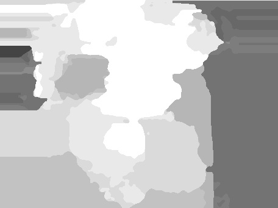

The depth-aware motion deblurring algorithm was developed by Xu and Jia :cite:`XU2012`. This algorithm operates on a stereo image pair and processes the images with the steps described below. For improving the result the process is done a second time with the deblurred images from the first run as input for the second one.

.. raw:: LaTex

    \begin{figure}[!htb]
        \centering
        \begin{subfigure}{.5\textwidth}
            \centering
            \includegraphics[width=170pt]{../images/mouse_left.jpg}
            \caption{left image}
        \end{subfigure}%
        \begin{subfigure}{.5\textwidth}
            \centering
            \includegraphics[width=170pt]{../images/mouse_right.jpg}
            \caption{right image}
        \end{subfigure}
        \caption{Blurred input images}
    \end{figure}

Disparity Estimation
--------------------

Disparity Map
'''''''''''''

- :red:`Find disparity maps of a blurred stereo image pair: left to right and right to left`
- :red:`down-sampling for blur reducing`
- :red:`different stereo algorithm as in paper. This shouldn't effect overall result.` Using SGBM :cite:`Hi2007`
- :red:`comments on SGBM parameters: choose of regularization term for smoothing, min disparity?`
- :red:`right to left: flip images such that SGBM works`
- :red:`violation of stereo matching condition. handle boundary pixel separately`

Occlusions
''''''''''

:red:`Cross-Checking to find occlusion regions.` In this implementation there is no cross checking
because SGBM handles occluded regions already.

Occlusions are filled with smallest neighbor disparity. Assumption: just objects with small
disparity can be occluded.

.. raw:: LaTex

    \begin{figure}[!ht]
        \centering
        \begin{subfigure}{.5\textwidth}
            \centering
            \includegraphics[width=170pt]{../images/dmap_small.jpg}
            \caption{with occlusions}
        \end{subfigure}%
        \begin{subfigure}{.5\textwidth}
            \centering
            \includegraphics[width=170pt]{../images/dmap_small_filled.jpg}
            \caption{with filled occlusions}
        \end{subfigure}
        \caption{disparity map}
    \end{figure}

Quantization
''''''''''''

:red:`PSF estimation is less extensive if the disparity layers are reduced.` quantize disparity 
values to l regions, where l is set to approximate PSF width or height. :red:`how to approximate
the PSF width/height?`

- :red:`using k-means for clustering`
- :red:`sort clusters for representing depth graduation`

   quantized disparity map with 25 regions

Region-Tree Construction
------------------------

This is needed for robust PSF estimation.

- :red:`see documentation of RegionTree class`

PSF Estimation for Top-Level Regions
------------------------------------

This follows the algorithm of :cite:`XU2010`.

:red:`tried to implement the two-phase kernel estimation` but unfortunately this couldn't be finished in time. So the provided exe is used to generate the top-level PSFs which are necessary to go on with the main algorithm.

- :red:`used edge tapering for region images to reduce high frequencies at the borders of the regions - so initial PSF estimation for the top level regions can be done with any kernel estimation algorithm`

PSF Propagation
---------------

Blur Removal
------------

