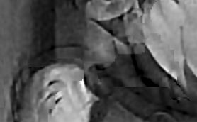

The reference implementation was used to deblur the same stereo image pair as presented in the paper. The reference implementation can not achieve the same results as shown in the paper. Hence this chapter discusses the problems leading to the different results and general difficulties of the proposed algorithm.

Result Comparison
+++++++++++++++++

As shown in figure :ref:`result-compare` the results of the first iteration differ. The reference implementation generates more ringing artifacts resulting in brighter and darker regions. The result of the paper for the left view looks more smooth. The paper unfortunately does not present the result of the right view.

.. raw:: LaTex

    \begin{figure}[!htb]
        \centering
        \begin{subfigure}{.5\textwidth}
            \centering
            \includegraphics[width=170pt]{../images/deblur-left-irls.png}
            \caption{reference implementation (left view)}
        \end{subfigure}%
        \begin{subfigure}{.5\textwidth}
            \centering
            \includegraphics[width=170pt]{../images/deblur-right-irls.png}
            \caption{reference implementation (right view)}
        \end{subfigure}
        \begin{subfigure}{.5\textwidth}
            \centering
            \includegraphics[width=170pt]{../images/mouse-result-1it-left-gray.jpg}
            \caption{result paper (left view)}
        \end{subfigure}
        \caption{Comparison results after 1. iteration}
        \label{result-compare}
    \end{figure}

The artifacts in the result of the reference implementation make it impossible to do a second iteration step since the "refined" disparity map computed from the deblurred views is worser than the initial disparity map of the blurred images. The disparity map of the deblurred views is shown in figure :ref:`dmap-2` using the same parameters for disparity estimation with graph-cut :cite:`Kolmogorov2001` as used in the first iteration. Even especially tuned parameters for this disparity estimation yielding a more smoothed result does not refine the initial disparity. This could be explained by the mismatch of corresponding pixels due to different color values caused by the artifacts (like in the regions of the ears).

.. raw:: LaTex

    \begin{figure}[!ht]
        \centering
        \begin{subfigure}{.35\textwidth}
            \centering
            \includegraphics[width=115pt]{../images/dmap-final-left.png}
            \caption{initial}
        \end{subfigure}%
        \begin{subfigure}{.35\textwidth}
            \centering
            \includegraphics[width=115pt]{../images/dmap-algo-left-2.png}
            \caption{2. run}
        \end{subfigure}%
        \begin{subfigure}{.35\textwidth}
            \centering
            \includegraphics[width=115pt]{../images/dmap-algo-left-2-tuned.png}
            \caption{2. run (tuned)}
        \end{subfigure}
        \caption{disparity maps}
        \label{dmap-2}
    \end{figure}

Problem Discussion
++++++++++++++++++

The ringing artifacts in the results of the reference implementation are mainly caused due to errors in the estimated PSFs. Although most regions of the deblurred image are affected by artifacts the background is deblurred very well. The reason for this is the distinct **texture** in this region. The PSF estimation heavily relies on edges in the image which are present if there is texture. Thus the PSF estimation is guided by these edges. In regions with less texture like the foots of the mouse there are no edges and therefore the estimation of the correct blur kernel is difficult introducing errors. Because this region has a smooth color gradient the deconvolution of this area with a wrong PSF yields ringing artifacts.

.. raw:: LaTex

    \begin{figure}[!ht]
        \centering
        \begin{subfigure}{.35\textwidth}
            \centering
            \includegraphics[width=100pt]{../images/mid-0-region-left.png}
            \caption{depth-layer 0}
        \end{subfigure}%
        \begin{subfigure}{.35\textwidth}
            \centering
            \includegraphics[width=100pt]{../images/mid-3-region-left.png}
            \caption{depth-layer 3}
        \end{subfigure}%
        \begin{subfigure}{.35\textwidth}
            \centering
            \includegraphics[width=100pt]{../images/mid-11-region-left.png}
            \caption{depth-layer 11}
        \end{subfigure}
        \caption{depth-layers with very small regions}
        \label{small-layers}
    \end{figure}

The region tree was proposed to guide the PSF estimation. It depends one the **disparity estimation**. The paper shows very nice disparity estimates for their blurred views and the deblurred views in the second iteration. Unfortunately it was not mentioned which parameters where used to achieve this results. It was not possible to get such good disparity estimates. The initial disparity estimation in the reference implementation has some wrong estimates especially next to the right ear. This errors affect the depth layers on which the region tree is build. Twelve different depth layers are used to create the region tree where layer 0 to 3 are the foreground, layer 4 to 7 are of medium depth and layer 8 to 11 are the background. The figure :ref:`small-layers` shows some depth layers yield from this erroneous disparity estimation. It can be seen that the depth layer 0 and 3 are used for PSF estimation of the foreground but actual belonging to the background. Depth layer 3 contains an edge too so it influences the result of this estimation.

Another fact is that small regions mostly lacking any texture like the one of depth layer 11 can not improve the PSF estimation. Therefore they could be ignored.

The main effect on the deconvolution result has the estimated PSF. The **PSF estimation** for the mid-/leaf-level nodes mostly yields blurry kernels as shown in :ref:`psf-estimate` whereas the estimated blur kernels of the paper look very sparse. The authors already used a blur kernel refinement step in one of their other papers :cite:`Xu2010`. A sparse blur kernel is produced by iteratively removing values from the kernel preserving its shape. It could be used here too.

.. raw:: LaTex

    \begin{figure}[!ht]
        \centering
        \begin{subfigure}{.35\textwidth}
            \centering
            \includegraphics[width=35pt]{../images/mid-5-kernel-selection-1.png}
            \caption{psf estimate}
        \end{subfigure}%
        \begin{subfigure}{.35\textwidth}
            \centering
            \includegraphics[width=110pt]{../images/mid-5-region-left.png}
            \caption{corresponding region}
        \end{subfigure}

        \caption{example for blurry PSF estimate}
        \label{psf-estimate}
    \end{figure}

A general problem of the proposed algorithm lies in the **PSF selection** scheme. The quality measure for correct deblurred images is reduced to the existence of salient edges in the deblurred image. The assumption on salient edges in natural images is right but the measurement prefers images with high contrast due to the salient edges the contrast produces. The figure :ref:`wrong-select` shows an example of the deconvolution of a blurred region with two PSF candidates. The selection scheme prefers the deblurred image with higher contrast whereas a human would prefer the other image. Hence the energy function used for the comparison of deconvolution result could be enhanced by a term preferring images with a moderate contrast.

.. raw:: LaTex

    \begin{figure}[!ht]
        \centering
        \begin{subfigure}{.5\textwidth}
            \centering
            \includegraphics[width=100pt]{../images/mid-16-deconv-0.png}
            \caption{chosen from algo}
        \end{subfigure}%
        \begin{subfigure}{.5\textwidth}
            \centering
            \includegraphics[width=100pt]{../images/mid-16-deconv-1.png}
            \caption{prefered by human}
        \end{subfigure}

        \caption{top-level-regions (left view) and their PSFs (using two-phase kernel estimation executable)}
        \label{wrong-select}
    \end{figure}

In the end the result of the whole algorithm is affected by the chosen **deconvolution method** used for the initial PSF estimation of mid-/leaf-level nodes and deblurring of the region with the different candidates in the PSF selection. The figure :ref:`result-deconv` shows the possible results of the first iteration looking at the eyes in detail. As mentioned before the deconvolution in the frequency domain is fast but yields ringing artifacts disturbing the PSF estimation. The spatial deconvolution using IRLS is slower but yields less artifacts (but for artifacts caused by wrong PSF estimation). It is not stated in the paper which method is used for the deconvolution.

.. raw:: LaTex

    \begin{figure}[!htb]
        \centering
        \begin{subfigure}{.5\textwidth}
            \centering
            \includegraphics[width=160pt]{../images/deblur-left-fft.png}
            \caption{deconvolution using FFT}
        \end{subfigure}%
        \begin{subfigure}{.5\textwidth}
            \centering
            \includegraphics[width=100pt]{../images/deblur-left-fft-detail-1.png}
            \caption{detail (FFT)}
        \end{subfigure}
        \begin{subfigure}{.5\textwidth}
            \centering
            \includegraphics[width=160pt]{../images/deblur-left-irls.png}
            \caption{deconvolution using IRLS}
        \end{subfigure}%
        \begin{subfigure}{.5\textwidth}
            \centering
            \includegraphics[width=100pt]{../images/deblur-left-irls-detail-1.png}
            \caption{detail (IRLS)}
        \end{subfigure}
        \caption{Influence of chosen deconvolution method (used within the algorithm process)}
        \label{result-deconv}
    \end{figure}

A problem of the reference implementation are visible **region boundaries** in the final deconvolution. As shown figure :ref:`borders` the region boundary can be clearly seen. The deconvolution is done region-wise taking the adjusted weight for reducing artifacts into account. But simply merging all deconvolved regions together yields the shown result for some regions. This may by caused by incorrect PSF estimates for some regions resulting in contrast differences to neighboring regions.

   :label:`borders` region boundaries in final deconvolution