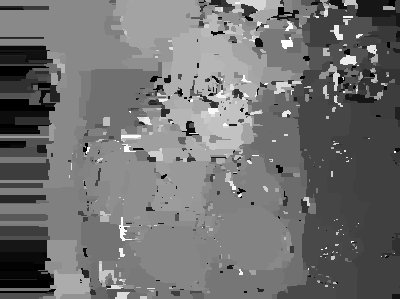

- run reference implementation on same images as the paper -> cannot achieve the same results -> figure :ref:`result-compare`

.. raw:: LaTex

    \begin{figure}[!htb]
        \centering
        \begin{subfigure}{.5\textwidth}
            \centering
            \includegraphics[width=170pt]{../images/mouse-result-left-gray.jpg}
            \caption{result of paper}
        \end{subfigure}%
        \begin{subfigure}{.5\textwidth}
            \centering
            \includegraphics[width=170pt]{../images/deconv-0.png}
            \caption{reference implementation (first run)}
        \end{subfigure}
        \caption{Comparison paper results with reference implementation}
        \label{result-compare}
    \end{figure}

- :red:`add results for other sample images of paper?`

- just able to do one run of the algorithm because "refined disparity map" would be much worser than the disparity map of the blurred images -> see figure :ref:`dmap-2`

   :label:`dmap-2` disparity map of results of first run

**influence deconvolution method**

.. raw:: LaTex

    \begin{figure}[!htb]
        \centering
        \begin{subfigure}{.5\textwidth}
            \centering
            \includegraphics[width=170pt]{../images/deblur-left-fft.png}
            \caption{deconvolution using FFT}
        \end{subfigure}%
        \begin{subfigure}{.5\textwidth}
            \centering
            \includegraphics[width=170pt]{../images/deblur-left-irls.png}
            \caption{deconvolution using IRLS}
        \end{subfigure}
        \caption{Influence of chosen deconvolution method (used within the algorithm process)}
        \label{result-deconv}
    \end{figure}

- child psf estimation used image deconvolved with parent psf
- psf selection deconvolves images
- results depends on chosen method -> figure :ref:`result-deconv`
- the paper doesn't mention how they do the deconvolution

Problem Discussion
++++++++++++++++++

**depth-layers**

- very small layers -> see figure :ref:`small-layers`
- :red:`some explanation`

.. raw:: LaTex

    \begin{figure}[!ht]
        \centering
        \begin{subfigure}{.35\textwidth}
            \centering
            \includegraphics[width=100pt]{../images/mid-0-region-left.png}
            \caption{depth-layer 0}
        \end{subfigure}%
        \begin{subfigure}{.35\textwidth}
            \centering
            \includegraphics[width=100pt]{../images/mid-3-region-left.png}
            \caption{depth-layer 3}
        \end{subfigure}%
        \begin{subfigure}{.35\textwidth}
            \centering
            \includegraphics[width=100pt]{../images/mid-11-region-left.png}
            \caption{depth-layer 11}
        \end{subfigure}
        \caption{depth-layers with very small regions}
        \label{small-layers}
    \end{figure}

**psf estimation**

.. raw:: LaTex

    \begin{figure}[!ht]
        \centering
        \begin{subfigure}{.35\textwidth}
            \centering
            \includegraphics[width=35pt]{../images/mid-5-kernel-selection-1.png}
            \caption{psf estimate}
        \end{subfigure}%
        \begin{subfigure}{.35\textwidth}
            \centering
            \includegraphics[width=100pt]{../images/mid-5-region-left.png}
            \caption{region}
        \end{subfigure}%
        \begin{subfigure}{.35\textwidth}
            \centering
            \includegraphics[width=100pt]{../images/mid-5-deconv-1-e0.191212.png}
            \caption{deconvolved region}
        \end{subfigure}

        \caption{example for blurry PSF estimate}
        \label{psf-estimate}
    \end{figure}

- psf estimates are very blurry -> see figure :ref:`psf-estimate` -> :red:`reason?`
- maybe they use a psf refinement step of their two-phase kernel estimation paper

**psf selection**

- the estimated kernels result in images with high contrast which are prefered by the psf selection scheme due to salient edges
- human eye would choose result of other kernel -> figure :ref:`wrong-select`

.. raw:: LaTex

    \begin{figure}[!ht]
        \centering
        \begin{subfigure}{.5\textwidth}
            \centering
            \includegraphics[width=100pt]{../images/mid-10-deconv-0.png}
            \caption{chosen from algo}
        \end{subfigure}%
        \begin{subfigure}{.5\textwidth}
            \centering
            \includegraphics[width=100pt]{../images/mid-10-deconv-1.png}
            \caption{prefered by human}
        \end{subfigure}

        \caption{top-level-regions (left view) and their PSFs (using two-phase kernel estimation executable)}
        \label{wrong-select}
    \end{figure}

**deblurring**

- final deconvolution: handling of different regions -> can see regions borders in my result

-:red:`other things to discuss?`